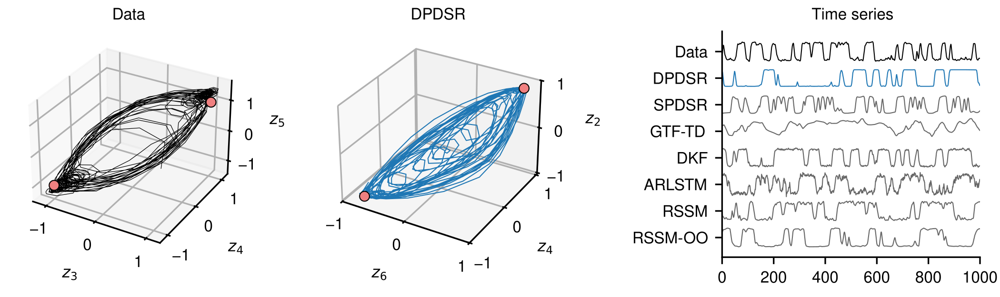

# Double projection for reconstructing dynamical systems: between stochastic and deterministic regimes


This repository contains the code and data associated with the paper [[1]](#references).
In the paper, we evaluate the capabilities of several methods for dynamical system reconstruction from data, and we propose a novel variant from the dynamical VAE family named **double projection dynamical system reconstruction** (DPDSR). In particular, we focus on the analysis of the discovered dynamical systems, the role of the noise in the systems, and the nature of their attractors. 

<p align="center">

</p> 


### Repository structure

The repository is structured as follows:

- `conf/` contains the configuration files for the analyzed problems. An example configuration file for a single model and training configuration is `conf/example.yaml`. The parameter sweeps are described by the `.py` files (see below on how to use them).
- `data/` contains the datasets used in the study.
- `dpdsr/` contains the core code.
- `run/`  is the target directory where the outputs of the runs will be stored.
- `scripts/` contains the scripts to train and run the models.
- `env.yml` describes the Python environment.
- `Snakefile` describes and serves to execute the study workflow using Snakemake.

### Setting up

Create the Python environment with mamba (or equivalently with conda):
```
mamba env create -f env.yml -n <ENV_NAME>
```

### Running

The training of a single model can be ran by
```
python scripts/train.py conf/example.yaml -c1
```

The parameter sweeps are described by the the configuration files following naming scheme `conf/<EXPERIMENT>/<DATASET>-<MODEL>.py`. 
They can be ran with Snakemake. The Snakemake worflow for training and evaluation is described by `Snakefile`. To run the parameter sweeps described by a configuration file execute
```
export CONF="<PATH_TO_CONFIG_FILE>"
snakemake all
```
with appropriate Snakemake constraints for your computing environment.

### Naming note

For reasons of backward compatibility, in the configuration files and in the code the alternative abbreviation `dsrn` is used in place of `dpdsr`. 

### License

The code is licensed under the MIT license.

### References

[1] Sip, V., Breyton, M., Petkoski, S., & Jirsa, V. (2026). Double projection for reconstructing dynamical systems: between stochastic and deterministic regimes. arXiv preprint arXiv:2510.01089. https://doi.org/10.48550/arXiv.2510.01089
